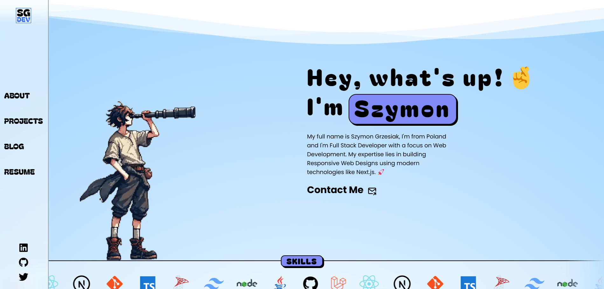

# My Portfolio and Blog

Welcome to my portfolio and blog! This repository showcases my projects, thoughts, and experiences as I explore the world of technology and development.

## About
This portfolio is a collection of my work and ideas. It includes:
- **Projects**: Some of the projects I have worked on and would like to share.
- **Blog**: My personal blog posts about coding, learning, and life.

Feel free to browse and learn from my work, but please note the usage restrictions below.

---

## License and Copyright

© [2024] [Szymon Grzesiak]. All rights reserved.

This repository is shared for **viewing purposes only**. Redistribution, modification, and use of the code or content in any form or for any purpose without prior written consent are strictly prohibited.

If you have any questions or would like to discuss collaborations, feel free to reach out!

---

## Contact
- Email: [szymongrzesiak.pl@gmail.com]
- Website: [https://szymongrzesiak.dev/)]
- LinkedIn: [https://www.linkedin.com/in/szymon-grzesiak-296873200/]